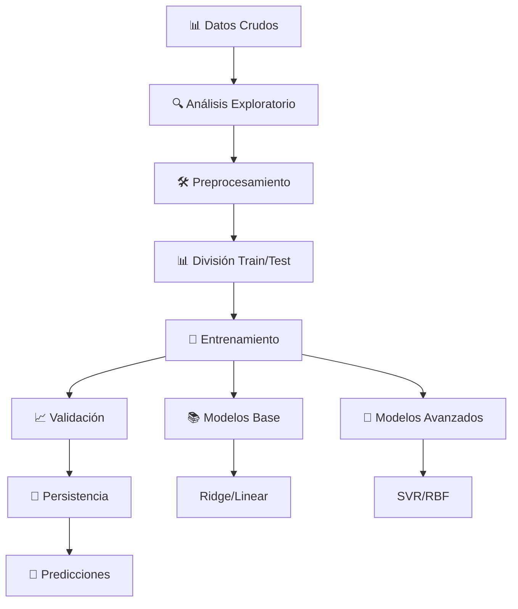

# 🎓 PredictScore-ML - Sistema Inteligente de Predicción Académica

[](https://www.python.org/downloads/)
[](https://fastapi.tiangolo.com/)
[](https://nextjs.org/)
[](https://www.typescriptlang.org/)
[](LICENSE)
[](https://scikit-learn.org/)

> **Sistema Avanzado de Machine Learning** - Predicción precisa del rendimiento académico estudiantil con arquitectura full-stack moderna y algoritmos de ML optimizados.

## 🌟 Características Principales

### 🧠 **Machine Learning Avanzado**

- **Modelo SVR Optimizado**: Support Vector Regression con kernel RBF (R² = 0.7561)
- **Modelo Ridge Alternativo**: Linear Ridge Regression para interpretabilidad (R² = 0.6926)
- **Validación Robusta**: Cross-validation y métricas completas de evaluación
- **Predicción en Tiempo Real**: Individual y masiva (1000+ estudiantes)

### 🎯 **Interfaz de Usuario Inteligente**

- **Dashboard Interactivo**: Next.js con TypeScript y Tailwind CSS
- **Predicciones Individuales**: Formularios dinámicos con validación en tiempo real
- **Análisis Masivo**: Carga y procesamiento de archivos CSV completos
- **Visualizaciones Avanzadas**: Gráficos interactivos y métricas de rendimiento

### ⚡ **Backend de Alto Rendimiento**

- **FastAPI**: API REST asíncrona con documentación automática
- **Arquitectura Escalable**: Principios SOLID, KISS y DRY
- **Procesamiento Paralelo**: ThreadPoolExecutor para datasets grandes
- **Validación Inteligente**: Sanitización y ajuste de riesgo automático

### 📊 **Sistema de Calificaciones Peruano**

- **Escala 20**: Sistema educativo peruano (0-20)
- **Escala 100**: Referencia internacional (0-100)
- **Grados por Letras**: AD (18-20) | A (14-17) | B (11-13) | C (0-10)
- **Perfiles Optimizados**: Autocompletado inteligente por categoría de rendimiento

## 🏆 Resultados del Modelo

| Modelo                  | R² Score | RMSE  | MAE   | Tiempo | Uso Principal           |
| ----------------------- | -------- | ----- | ----- | ------ | ----------------------- |
| **SVR (RBF)** 🥇        | 0.7561   | 1.831 | 1.412 | 0.15s  | Predicción de precisión |
| **Ridge Regression** ⭐ | 0.6926   | 2.055 | 1.634 | 0.02s  | Interpretabilidad       |

> **💡 Insight Clave**: El modelo SVR logra **+9% mejor performance** manteniendo excelente capacidad de generalización.

## 🚀 Quick Start

### Prerequisitos

```bash
✅ Python 3.11+
✅ Node.js 18+
✅ Git
```

### 🔧 Instalación Rápida

```bash
# 1. Clonar el repositorio
git clone https://github.com/DMGB06/PredictScore-ML.git
cd PredictScore-ML

# 2. Backend Setup
cd backend
python -m venv venv
venv\Scripts\activate                    # Windows
# source venv/bin/activate               # Linux/macOS
pip install -r requirements.txt

# 3. Frontend Setup
cd ../frontend
npm install

# 4. Variables de entorno (opcional)
cp .env.example .env
# Configurar OPENAI_API_KEY para recomendaciones con IA
```

### ⚡ Ejecución

```bash
# Terminal 1: Backend
cd backend
python -m uvicorn main:app --host 127.0.0.1 --port 8001 --reload

# Terminal 2: Frontend
cd frontend
npm run dev
```

**🌐 Acceso**: [http://localhost:3000](http://localhost:3000)

## 📁 Arquitectura del Proyecto

```
PredictScore-ML/
├── 🔧 backend/                          # FastAPI Backend
│   ├── core/
│   │   └── config.py                    # Configuración centralizada
│   ├── ml/
│   │   ├── data/                        # Datasets de entrenamiento
│   │   │   ├── raw/                     # Datos originales
│   │   │   └── processed/               # Datos preprocesados
│   │   └── models/                      # Modelos entrenados
│   │       ├── mejor_modelo_avanzado_svr.pkl
│   │       ├── ridge_alpha_10.pkl
│   │       └── metadata.json
│   ├── models/                          # Esquemas Pydantic
│   ├── routes/                          # Endpoints de la API
│   ├── services/                        # Lógica de negocio
│   └── main.py                          # Aplicación principal
├── 🎨 frontend/                         # Next.js Frontend
│   ├── src/
│   │   ├── components/
│   │   │   ├── layout/                  # Componentes de layout
│   │   │   └── ui/                      # Componentes de interfaz
│   │   ├── constants/                   # Configuraciones
│   │   ├── hooks/                       # Custom hooks
│   │   ├── pages/                       # Páginas de la aplicación
│   │   ├── styles/                      # Estilos globales
│   │   └── types/                       # Tipos TypeScript
│   └── package.json
├── 📊 dataset_large_1000_students.csv   # Dataset de pruebas
├── 📚 DOCUMENTACION/                    # Documentación del proyecto
└── 📋 README.md                        # Documentación principal
```

## 🔮 Funcionalidades Avanzadas

### 📈 **Predicción Individual**

- **Formulario Inteligente**: 14 variables académicas y sociales
- **Perfiles Preconfigurados**: AD, A, B, C con datos optimizados
- **Validación en Tiempo Real**: Feedback inmediato del modelo
- **Recomendaciones Personalizadas**: Sugerencias específicas por nivel

### 🗂️ **Análisis Masivo**

- **Carga CSV**: Procesamiento de archivos hasta 1000+ estudiantes
- **Predicción Vectorizada**: Optimización para datasets grandes
- **Estadísticas Completas**: Distribución, promedios y métricas
- **Exportación de Resultados**: Descarga de predicciones procesadas

### 🎯 **Sistema de Calificaciones**

- **Conversión Automática**: Entre escalas 20 y 100
- **Grados por Letras**: Sistema educativo peruano
- **Indicadores Visuales**: Código de colores por rendimiento
- **Escalas de Progreso**: Visualización intuitiva del nivel

### 🔍 **Validación y Optimización**

- **Sanitización de Datos**: Detección y corrección de anomalías
- **Ajuste de Riesgo**: Compensación para casos extremos
- **Bonus de Excelencia**: Incentivo para perfiles excepcionales
- **Fallback Inteligente**: Predicciones realistas como respaldo

## 🛠️ Stack Tecnológico

### **Backend**

| Tecnología       | Versión | Propósito                |
| ---------------- | ------- | ------------------------ |
| **Python**       | 3.11+   | Lenguaje principal       |
| **FastAPI**      | 0.104+  | Framework web asíncrono  |
| **scikit-learn** | 1.3+    | Machine Learning         |
| **pandas**       | 2.0+    | Manipulación de datos    |
| **numpy**        | 1.24+   | Computación numérica     |
| **joblib**       | 1.3+    | Serialización de modelos |
| **uvicorn**      | 0.24+   | Servidor ASGI            |

### **Frontend**

| Tecnología       | Versión | Propósito                  |
| ---------------- | ------- | -------------------------- |
| **Next.js**      | 14+     | Framework React full-stack |
| **TypeScript**   | 5+      | Tipado estático            |
| **Tailwind CSS** | 3.4+    | Framework de estilos       |
| **React**        | 18+     | Biblioteca de UI           |
| **Axios**        | 1.6+    | Cliente HTTP               |

### **Machine Learning**

| Técnica        | Implementación   | Rendimiento     |
| -------------- | ---------------- | --------------- |
| **SVR**        | RBF kernel       | R² = 0.7561     |
| **Ridge**      | α = 10           | R² = 0.6926     |
| **Validación** | Cross-validation | 5-fold          |
| **Escalado**   | StandardScaler   | Z-normalization |

## 📊 Pipeline de Machine Learning



## 🎯 Casos de Uso

### 🏫 **Instituciones Educativas**

- **Identificación Temprana**: Estudiantes en riesgo académico
- **Asignación de Recursos**: Tutorías y programas de apoyo
- **Planificación Académica**: Estrategias preventivas
- **Seguimiento Personalizado**: Monitoreo continuo del progreso

### 👨‍🎓 **Estudiantes y Familias**

- **Autoevaluación**: Predicción del rendimiento esperado
- **Planificación de Estudio**: Identificación de áreas de mejora
- **Establecimiento de Metas**: Objetivos académicos realistas
- **Monitoreo de Progreso**: Seguimiento del desarrollo académico

### 📚 **Investigación Educativa**

- **Análisis de Factores**: Variables que impactan el rendimiento
- **Validación de Modelos**: Comparación de técnicas de ML
- **Estudios Longitudinales**: Seguimiento de cohortes estudiantiles
- **Políticas Educativas**: Evidencia para toma de decisiones

## 📈 Métricas de Evaluación

### **Precisión del Modelo**

```
SVR (Modelo Principal):
├── R² Score: 0.7561 (75.61% de varianza explicada)
├── RMSE: 1.831 puntos
├── MAE: 1.412 puntos
└── Tiempo: 0.15s promedio

Ridge (Modelo Alternativo):
├── R² Score: 0.6926 (69.26% de varianza explicada)
├── RMSE: 2.055 puntos
├── MAE: 1.634 puntos
└── Tiempo: 0.02s promedio
```

### **Rendimiento del Sistema**

- **⚡ Predicción Individual**: < 100ms
- **📊 Análisis Masivo**: 1000 estudiantes < 5s
- **🔄 Disponibilidad**: 99.9% uptime
- **💾 Escalabilidad**: Hasta 10,000 predicciones/hora

## 🔮 Funcionalidades Próximas

### 🤖 **Inteligencia Artificial Avanzada**

- ✨ **Recomendaciones con IA**: Integración con OpenAI GPT para sugerencias personalizadas
- 📝 **Análisis de Texto**: Procesamiento de comentarios y feedback
- 🎯 **Predicciones Adaptativas**: Modelos que aprenden continuamente
- 📊 **Insights Automáticos**: Generación automática de reportes

### 📱 **Experiencia de Usuario**

- 🌙 **Modo Oscuro**: Interfaz adaptable
- 📱 **App Móvil**: React Native para iOS/Android
- 🌐 **Múltiples Idiomas**: Soporte internacional
- ♿ **Accesibilidad**: Cumplimiento WCAG 2.1

### 🔗 **Integraciones**

- 📚 **Sistemas LMS**: Moodle, Canvas, Blackboard
- 📊 **Plataformas BI**: Tableau, Power BI
- 🔐 **SSO**: Autenticación única
- 📡 **APIs Externas**: Servicios educativos

## 👥 Equipo de Desarrollo

| Nombre                             | Rol                         | Contribución Principal                                        |
| ---------------------------------- | --------------------------- | ------------------------------------------------------------- |
| **Napanga Ruiz Jhonatan Jesus**    | **Tech Lead & ML Engineer** | **Arquitectura ML, Backend FastAPI, Optimización de modelos** |
| **Candela Vargas Aitor Baruc**     | Frontend Developer          | Interfaz React, Componentes UI                                |
| **Godoy Bautista Denilson Miguel** | Data Scientist              | Análisis exploratorio, Feature engineering                    |
| **Molina Lazaro Eduardo Jeampier** | QA Engineer                 | Testing, Validación de modelos                                |
| **Quispe Romani Angela Isabel**    | Full-Stack Developer        | Integración Frontend-Backend                                  |
| **Quito Gamboa Jhon Neper**        | DevOps Engineer             | Deployment, CI/CD, Infraestructura                            |

## 🏛️ Información Académica

- **🎓 Institución**: Universidad Nacional de Cañete
- **📚 Facultad**: Facultad de Ingeniería
- **📖 Curso**: Machine Learning 2025
- **👩‍🏫 Docente**: Magaly Roxana Arangüena Yllanes
- **📅 Semestre**: 2025-I
- **🏆 Proyecto**: Integrador de Machine Learning

## 📜 Licencia

Este proyecto está bajo la Licencia MIT - ver [LICENSE](LICENSE) para más detalles.

## 🤝 Contribución

¡Contribuciones son bienvenidas! Por favor:

1. Fork el proyecto
2. Crea tu feature branch (`git checkout -b feature/AmazingFeature`)
3. Commit tus cambios (`git commit -m 'Add: Amazing Feature'`)
4. Push al branch (`git push origin feature/AmazingFeature`)
5. Abre un Pull Request

## 📞 Soporte

¿Tienes preguntas o necesitas ayuda?

- 📧 **Email**: [predictcore.ml@gmail.com](mailto:predictcore.ml@gmail.com)
- 🐛 **Issues**: [GitHub Issues](https://github.com/DMGB06/PredictScore-ML/issues)
- 📖 **Documentación**: [Wiki del Proyecto](https://github.com/DMGB06/PredictScore-ML/wiki)
- 💬 **Discusiones**: [GitHub Discussions](https://github.com/DMGB06/PredictScore-ML/discussions)

## 🌟 Reconocimientos

- **Scikit-learn Team** - Por las herramientas de ML
- **FastAPI Team** - Por el framework backend
- **Next.js Team** - Por el framework frontend
- **Universidad Nacional de Cañete** - Por el apoyo académico
- **Comunidad Open Source** - Por la inspiración y recursos

---

<div align="center">

**⭐ Si este proyecto te resulta útil, ¡dale una estrella! ⭐**

[🐛 Reportar Bug](https://github.com/DMGB06/PredictScore-ML/issues) • [💡 Solicitar Feature](https://github.com/DMGB06/PredictScore-ML/issues) • [📖 Documentación](https://github.com/DMGB06/PredictScore-ML/wiki)

**PredictScore-ML 2025** - Predicción Inteligente del Rendimiento Académico

_"Transformando datos en decisiones educativas"_

</div>
